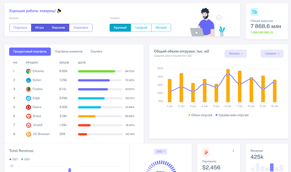
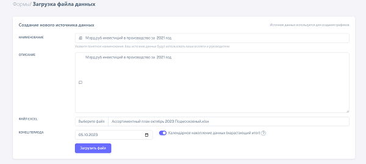

# Dashboard builder DASHA




### 1. Set your environment variables in .env file located in project root directory
.env file example can be found in root directory

## 2. Create external volume for db data storage

```

docker volume create dasha_postgres_data

```

## 3. Pull, build images and bring up the containers

```

docker-compose up -d

```
